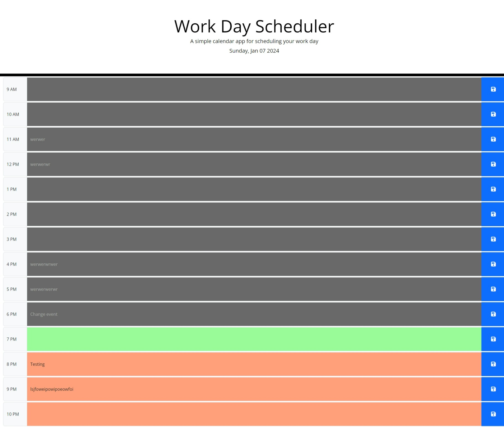

# Module Challenge – Third-Party APIs: Daily Planner App
## Description

This project is to create a calendar application for users to save events during business hours in the day.

Even though this is a challenging project, my worry about finishing the assignment has gone down since I’m more comfortable with drafting the logic first, before doubting if I could write the code. The more I learn, the more I can come up with the best knowledge of applying it to the specific part of the assignment, to meet the acceptance criteria.

The most difficult part this time is to select the elements without writing the code down one by one. For example, getting the hour format and fill down the timeblock using dayjs methods, and finding the right spot to insert click event function. 

I noticed that I get less dependent on projects by others this time, which is good that I’m making progress and become more original. What I’ve learned this time that help with my assignment are the jQuery.each() and .next().

When I was stuck in the final bit of this assignment, I looked at others’ code and managed to think of a simpler way to do this, which made me feel pleased. As I study more in the bootcamp, I can start producing projects with some originality and get rid of the mindset of being an outsider of the industry.

Link to the live application:
https://leesoohang.github.io/module7-daily-planner

Link to the repository:
https://github.com/leesoohang/module7-daily-planner.git

## Installation
N/A

## Usage
The daily planner application can be found in ‘index.html’ along with the stylesheet and script.

Screenshot:

## Credits
Day.js: 

https://dayjs.gitee.io/docs/en/get-set/get-set

Work Day Scheduler by Chris Bonifacio – CodePen:

https://codepen.io/judebloom/pen/RwGbVWB?editors=0010

Work Day Scheduler by Denzell Grant – GitHub:

https://denzgrant.github.io/Work-Day-Scheduler/

Work Day Scheduler by Heather Cooper – GitHub:

https://edenkhaos.github.io/05-work-day-scheduler/

Input Group – Bootstrap:

https://getbootstrap.com/docs/5.3/forms/input-group/

jQuery.each() – jQuery:

https://api.jquery.com/jQuery.each/
